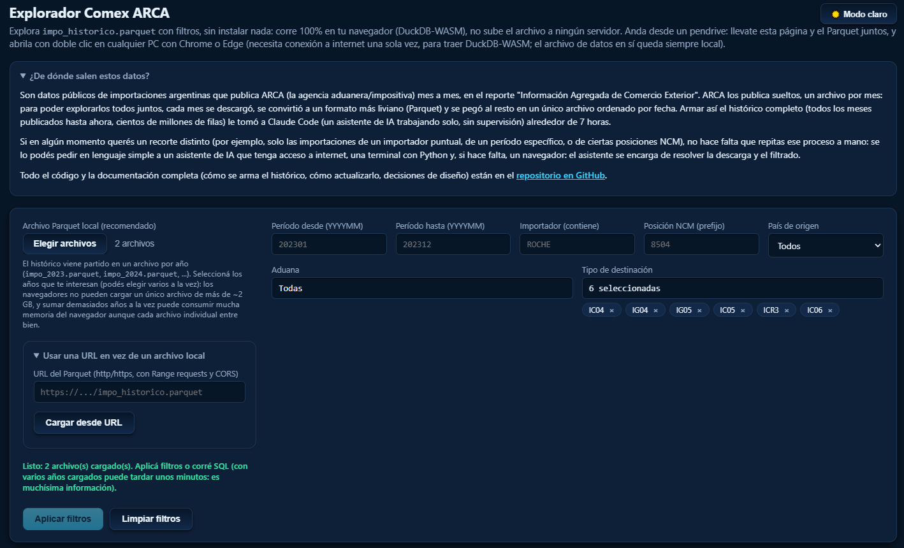
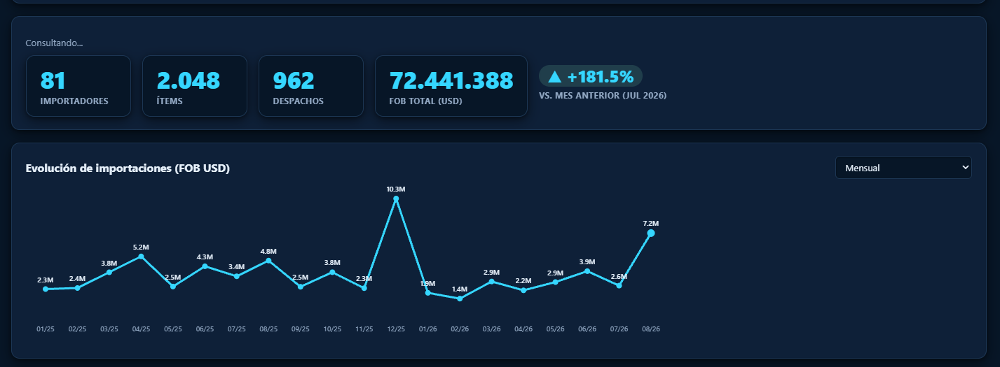
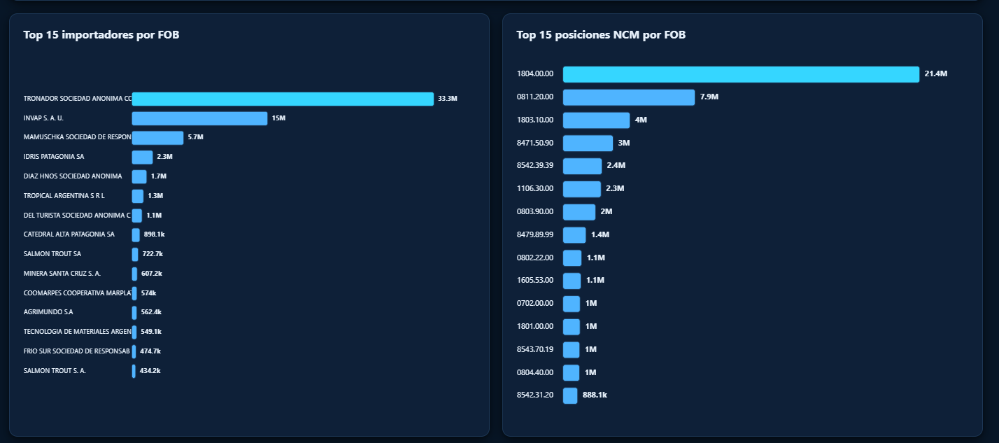
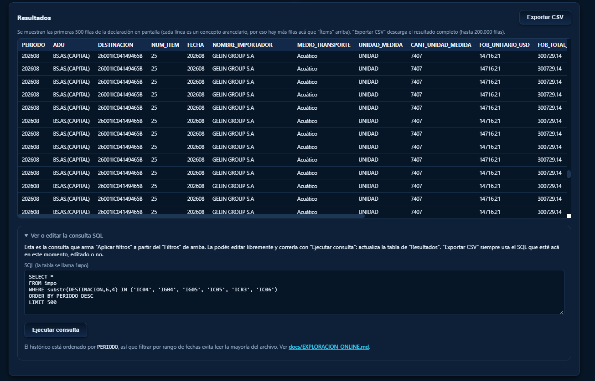

# Análisis Datos Comex ARCA

Herramientas en Python para descargar, convertir, consultar y filtrar datos públicos de comercio exterior argentino publicados por ARCA.

Fuente oficial: Información Agregada de Comercio Exterior de ARCA.

https://arca.gob.ar/operadoresComercioExterior/informacionAgregada/informacion-agregada.asp

Este repositorio está preparado para publicarse: no incluye bases mensuales, salidas generadas, ni listas comerciales reales de posiciones NCM. Los notebooks en `notebooks/` sí se versionan (a propósito): son tutoriales de uso, revisados y sin outputs, no exploraciones con datos propios.

## Para qué sirve

- Descargar y mantener al día **un único** `Data/impo_historico.parquet` con todas las importaciones mensuales de ARCA (`--actualizar`, ver más abajo).
- Consultar ese histórico por importador, NCM, resumen general o SQL libre.
- Generar una tabla final mensual con una fila por ítem.
- Filtrar posiciones NCM desde una lista local editable.
- Explorarlo desde tutoriales (`notebooks/`) o desde un prototipo web sin backend (`explorer/`, ver `docs/EXPLORACION_ONLINE.md`).

## Estructura

```text
.
|-- assets/                           (capturas de pantalla usadas en este README)
|-- Data/
|   |-- descargar_historico_impo.py   (descarga + consolida el historico unico)
|   |-- consultar_impo.py             (consultas rapidas por importador/NCM/SQL)
|   |-- consultar_impo_polars.py      (mismo resumen, referencia con polars)
|   |-- tabla_final.py                (tabla de una fila por item, un periodo)
|   |-- _fuente_impo.py               (resuelve historico vs. mensual suelto)
|   `-- impo_historico.parquet y demas datos locales, no versionados
|-- codigos/
|   `-- codigos_arca.py               (diccionarios de codigos ARCA/AFIP)
|-- notebooks/
|   |-- 01_introduccion.ipynb         (basico: cargar, fechas, filtros)
|   |-- 02_analisis_intermedio.ipynb  (series de tiempo, paises, NCM)
|   `-- 03_avanzado.ipynb             (rendimiento, memoria acotada, outliers)
|-- explorer/
|   |-- index.html                    (dashboard con filtros y graficos, DuckDB-WASM, sin backend)
|   |-- dividir_para_navegador.py     (parte impo_historico.parquet en un .parquet por año)
|   `-- data/                         (salida de dividir_para_navegador.py, no versionada)
|-- docs/
|   `-- EXPLORACION_ONLINE.md         (arquitectura de exploracion online/self-hosted)
|-- .claude/skills/actualizar-historico-arca/
|   `-- SKILL.md                      (runbook para actualizar el historico)
|-- exports/
|   `-- carpeta de trabajo local no versionada (ver más abajo)
|-- filtrar_posiciones.py
|-- posiciones_interes.ejemplo.txt
|-- requirements.txt
`-- README.md
```

Los datos y salidas están ignorados por Git: `.csv`, `.xlsx`, `.parquet`, `.lst`, `.zip`, bases locales y exports generados. `.claude/` está ignorado salvo la skill de arriba; `*.ipynb` está ignorado salvo lo que hay en `notebooks/`.

## Instalación

```powershell
python -m venv .venv
.venv\Scripts\activate
pip install -r requirements.txt
```

## Descargar y convertir importaciones

El producto final de este pipeline es **un solo archivo**: `Data/impo_historico.parquet`, con todos los meses ya unidos. Todo lo demás (ZIP, LST, Parquet mensual) es un archivo de trabajo intermedio, y se borra solo apenas queda incorporado al histórico.

### Un solo comando, para todo: `--actualizar`

Ya sea que sea la primera vez (`impo_historico.parquet` todavía no existe) o
que ya tengas un histórico y quieras traer los meses nuevos publicados desde
la última vez, el comando es siempre el mismo:

```powershell
python Data\descargar_historico_impo.py --actualizar
```

- **Si `impo_historico.parquet` no existe**: hace la carga completa de todo
  el rango que ARCA tenga publicado (puede tardar horas y usar harto disco
  temporal para el `ORDER BY` final, aunque libera ese espacio solo al
  terminar; ver "Corrido en una máquina con 4 GB de RAM" más abajo para lo
  que implica en una máquina chica).
- **Si ya existe**: mira el último período cargado, descarga y convierte
  solo lo nuevo, y lo agrega **sin resortear los cientos de millones de
  filas previas** (ver "Por qué DuckDB y por qué Parquet" más abajo para el
  detalle de cómo). Es la forma pensada para correr esto cada tanto, a mano
  o pidiéndoselo a un agente de Claude Code (ver la skill
  `actualizar-historico-arca` en `.claude/skills/`).
- Si ARCA todavía no publicó nada nuevo, termina enseguida sin tocar el
  archivo. Correrlo de más no rompe nada.

Otras banderas, para casos puntuales (la mayoría de las veces `--actualizar` solo alcanza):

- `--desde`/`--hasta YYYYMM`, `--mes YYYYMM` (repetible): para acotar a un rango o a meses puntuales en vez de todo lo publicado.
- `--sin-descarga --force`: no descarga nada, solo reconstruye el histórico desde los `impo_YYYYMM.parquet` que ya estén en `Data/` (resortea todo; para reparar el histórico, no para actualizarlo de rutina).
- `--keep-mensuales`: conserva los `impo_YYYYMM.parquet` de cada mes después de fusionarlos (por defecto se borran, para no duplicar espacio en disco).
- `--solo-listar`: lista los períodos que ARCA tiene publicados y termina, sin descargar nada.

No todos los meses tienen el archivo detallado por ítem/importador que usa este pipeline: **febrero a julio y septiembre de 2018** solo publican una versión "agregada" (sin nombre de importador ni detalle por ítem, solo totales por NCM y país, con columnas totalmente distintas). El script los detecta solos y los salta con un aviso, sin romperse; quedan como hueco conocido en el histórico.

### El archivo histórico único

`Data/impo_historico.parquet` tiene una fila por (declaración, ítem, concepto de arancel), igual que los Parquet mensuales, más una columna `PERIODO` (`YYYYMM`, texto) que identifica el mes de origen:

| Columna | Tipo | Notas |
|---|---|---|
| `PERIODO` | texto `YYYYMM` | Solo en el histórico consolidado, no en los Parquet mensuales sueltos. |
| `ADU` | texto | Código de aduana (ver `codigos/codigos_arca.py:ADUANAS`). |
| `DESTINACION` | texto | Número de declaración/despacho. |
| `NUM_ITEM` | entero | Ítem dentro de la declaración. |
| `FECHA` | texto `YYYYMM` | Igual que `PERIODO`, tal cual viene del `.lst`. |
| `NOMBRE_IMPORTADOR` | texto | Razón social. |
| `MEDIO_TRANSPORTE` | texto | Código (ver `codigos_arca.py:MEDIOS_TRANSPORTE`). |
| `UNIDAD_MEDIDA` | texto | Código (ver `codigos_arca.py:UNIDADES`). |
| `CANT_UNIDAD_MEDIDA` | double | Cantidad en esa unidad. |
| `FOB_UNITARIO_USD` | double | FOB del ítem; se repite en cada línea de tributo del mismo ítem. |
| `FOB_TOTAL_USD` | double | FOB total de la declaración; se repite en todos sus ítems. |
| `DIVISA` | texto | Moneda de la operación. |
| `PAIS_ORIGEN` / `PAIS_PROCEDENCIA` | texto | Código de país (ver `codigos_arca.py:PAISES`). |
| `POS_NCM` | texto | Posición arancelaria. |
| `ARANCEL_CONCEPTO` | texto | Tipo de tributo de esta línea. |
| `ARANCEL_MONTO` | double | Monto de ese tributo. |

`FECHA`/`PERIODO` son texto `YYYYMM`, no una fecha real. Para convertirlos a `DATE` (y así poder filtrar por rango, agrupar por año, etc.):

```sql
-- DuckDB / SQL: primer día del mes
strptime(PERIODO || '01', '%Y%m%d')::DATE

-- Filtrar un rango de fechas
SELECT * FROM read_parquet('Data/impo_historico.parquet')
WHERE PERIODO BETWEEN '202301' AND '202312';   -- todo 2023, comparación de texto YYYYMM

-- Agrupar por año (los primeros 4 caracteres de PERIODO)
SELECT substr(PERIODO, 1, 4) AS anio, sum(FOB_TOTAL_USD) FOB
FROM read_parquet('Data/impo_historico.parquet')
GROUP BY 1 ORDER BY 1;
```

```python
# pandas
import pandas as pd
df = pd.read_parquet("Data/impo_historico.parquet", columns=["PERIODO", "POS_NCM", "FOB_TOTAL_USD"])
df["fecha"] = pd.to_datetime(df["PERIODO"], format="%Y%m")
```

```python
# polars (lazy: no carga todo a RAM, solo las columnas que se usan)
import polars as pl
q = (
    pl.scan_parquet("Data/impo_historico.parquet")
    .with_columns(pl.col("PERIODO").str.strptime(pl.Date, "%Y%m").alias("fecha"))
    .filter(pl.col("fecha").is_between(pl.date(2023, 1, 1), pl.date(2023, 12, 31)))
)
```

Ver `notebooks/` para tutoriales completos, de básico a avanzado, con estos y otros ejemplos.

### Por qué DuckDB y por qué Parquet

Dos herramientas distintas, para dos trabajos distintos:

- **DuckDB** es el motor de *cómputo*: parsea el `.lst` (texto separado por `'`, con sniffing de tipos tolerante a columnas rotas, comillas literales y pies de reporte, ver más abajo), corre el `ORDER BY` de la consolidación, y resuelve consultas SQL ad hoc (`consultar_impo.py`) sin necesitar un servidor de base de datos ni cargar todo a RAM. Es la pieza que hace posible procesar archivos de varios GB en una máquina de 4 GB de RAM (ver la sección siguiente).
- **Parquet** es el formato de *almacenamiento*: columnar y comprimido (zstd), permite leer solo las columnas que hacen falta (column pruning) y saltear row groups enteros por rango de valores (predicate pushdown), en vez de leer el archivo entero para cada consulta. Además es el formato que hablan sin fricción DuckDB, pandas, polars y prácticamente cualquier herramienta de análisis moderna, así que sirve como interfaz estable entre este pipeline y lo que sea que alguien quiera hacer con los datos después.

Un detalle que vale la pena remarcar: el histórico consolidado (`agregar_al_historico`/`combinar_historico`) evita volver a ordenar los cientos de millones de filas ya existentes en cada actualización. Como los meses nuevos son siempre posteriores a todo lo que ya está en el histórico, alcanza con ordenar cada mes nuevo por separado (chico, entra cómodo en memoria) y pegarlo después del histórico existente: `PERIODO` ya queda creciente entre archivos, así que el resultado queda bien ordenado sin un `ORDER BY` completo sobre todo el dataset. Eso es lo que hace viable correr `--actualizar` seguido, en vez de re-sortear todo cada vez (que es justamente el paso que más RAM y disco temporal consume, ver la sección de 4 GB de RAM).

### Cuánto espacio ahorra Parquet frente al `.lst` crudo

El pipeline borra el `.lst` de cada mes apenas lo convierte (son texto plano sin comprimir, varios GB cada uno), así que no quedan todos guardados para medir el total exacto. Esta es una estimación a partir de una muestra de 7 meses de los que sí se pudo medir el tamaño real del `.lst` dentro del ZIP (sin necesidad de descomprimirlo, leyendo los metadatos del ZIP) contra el tamaño del Parquet mensual resultante:

| Período | `.lst` sin comprimir | Parquet mensual | Razón |
|---|---:|---:|---:|
| 2018-10 | 3.75 GiB | 55.6 MiB | 69x |
| 2018-11 | 3.18 GiB | 46.7 MiB | 68x |
| 2018-12 | 2.73 GiB | 40.6 MiB | 67x |
| 2021-05 | 4.70 GiB | 95.2 MiB | 51x |
| 2022-11 | 5.30 GiB | 20.8 MiB | 261x |
| 2023-08 | 6.84 GiB | 31.8 MiB | 220x |
| 2025-10 | 6.46 GiB | 45.3 MiB | 146x |

La razón varía mucho mes a mes (51x a 261x) según qué tan repetitivos son los valores de ese mes (más importadores/NCM distintos comprime peor). Tomando la razón ponderada por tamaño de esta muestra (≈100x) y aplicándola a los 88 meses con detalle transaccional que estaban cargados al momento de medir (6.36 GiB en Parquet mensual, antes de fusionarlos):

- **`.lst` crudo estimado (88 meses)**: entre ~320 GiB (extremo más comprimible) y ~1.66 TiB (extremo menos comprimible), con **~640 GiB** como estimación central.
- **`impo_historico.parquet` real (esos mismos 88 meses)**: **2.01 GiB** (616 millones de filas, 2018-01 a 2025-11).
- **Reducción**: entre ~160x y ~825x según el extremo, **~320x** en el caso central.

El histórico consolidado además pesa bastante menos que la simple suma de sus Parquet mensuales (2.01 GiB contra 6.36 GiB para esos 88 meses, ~3x menos): al quedar todo ordenado por `POS_NCM`/`DESTINACION`/ítem en un solo archivo, zstd encuentra muchos más valores repetidos consecutivos que en 88 archivos chicos ordenados cada uno por separado. Esto no es solo prolijidad: es la razón principal por la que "un solo archivo histórico" es más chico que "N archivos con la misma data".

(No cuenta los 7 meses de 2018 que solo tienen reporte agregado: son un formato distinto, mucho más chico, y no serían comparables.)

**Estado actual** (después de correr `--actualizar` por primera vez con esta versión): `impo_historico.parquet` tiene **683,858,821 filas, 97 meses, 2018-01 a 2026-08**, en **2.17 GiB**. Escalando la estimación de arriba proporcional al crecimiento en filas (683,858,821 / 616,041,305 ≈ 1.11x), el `.lst` crudo equivalente rondaría **~710 GiB** (rango ~355 GiB a ~1.8 TiB), es decir prácticamente el mismo orden de magnitud de reducción (~325x en el caso central). Esta cifra se va a volver a correr, no a recalcular a mano, en cada actualización futura: no hace falta mantenerla sincronizada a mano, es solo una foto de este momento.

### Corrido en una máquina con 4 GB de RAM

Este downloader se probó bajando el histórico completo (más de 100 meses, algunos con `.lst` de varios GB de texto plano) en una notebook con **4 GB de RAM en total**, muchas veces con menos de 1 GB libre por tener Chrome, VS Code y otras apps abiertas. Eso hizo salir a la luz varios problemas que un solo mes de prueba no muestra:

- **Ítems sin tributo asociado**: el campo de monto queda relleno de espacios en vez de vacío, y DuckDB no podía tipar la columna directamente desde el CSV. Se lee todo como `VARCHAR` y se castea con `TRY_CAST(NULLIF(TRIM(...), ''), tipo)`.
- **Pie de reporte al final de cada `.lst`**: líneas en blanco más un `"N rows selected."` después de la última fila real, que rompía el conteo de columnas esperado. Se filtra validando que `FECHA` tenga formato de período (`^[0-9]{6}$`).
- **Comillas literales en alguna razón social**: una empresa tiene un `"` como parte del nombre, y DuckDB lo tomaba como delimitador de cita en vez de texto plano. Se lee con `quotechar=""` para que no interprete ninguna comilla como tal.
- **Sin margen de RAM para meses de varios GB**: con `PRAGMA memory_limit` bajo (ajustado a mano según la RAM libre en el momento, entre 400 MB y 1 GB) y `threads=1`, DuckDB derrama a disco en vez de intentar usar toda la RAM disponible. Y lo más importante: **cada mes se convierte en un proceso de Python aparte** (`--convertir-uno PERIODO`, vía `subprocess.run`), así el sistema operativo libera toda esa memoria al terminar ese mes en particular, en vez de depender de que el runtime la libere solo entre iteraciones de un mismo proceso de larga duración.

Si corrés esto en una máquina todavía más chica, bajá `memory_limit` aún más en `Data/descargar_historico_impo.py` (buscá `PRAGMA memory_limit`).

## Notebooks

`notebooks/` tiene tres tutoriales, de básico a avanzado, pensados para leerse en orden:

1. **`01_introduccion.ipynb`**: cargar el histórico, columnas disponibles, fechas `YYYYMM` → `DATE`, filtros y agregados básicos.
2. **`02_analisis_intermedio.ipynb`**: series de tiempo, variación interanual, decodificar países/aduanas con `codigos_arca.py`, rankings por NCM e importador.
3. **`03_avanzado.ipynb`**: por qué el orden del archivo hace barato filtrar por fecha, `polars` lazy, procesar por partes con poca RAM, detección de outliers de precio, exportar subconjuntos grandes.

Se versionan sin outputs (correr y guardar limpio si se editan; ver `AGENTS.md`). Requieren `jupyterlab`, `matplotlib` y `polars` de `requirements.txt`:

```powershell
jupyter lab notebooks
```

## Explorar el dataset online o self-hosted (o desde un pendrive)

`explorer/index.html` es una página estática, sin backend, que corre **DuckDB directo en el navegador** (vía DuckDB-WASM) contra `impo_historico.parquet`, con filtros (importador, NCM, país, aduana, tipo de destinación, rango de fechas), gráficos (evolución mensual/trimestral/anual/interanual, top 15 importadores, top 15 NCM) y un indicador de variación contra el período anterior. Sin caja de SQL obligatoria: los filtros arman las consultas solos (aunque queda una sección "Avanzado" con SQL libre para quien lo quiera).

Filtros, con varios años cargados a la vez y selección múltiple en aduana / tipo de destinación:

<p align="center"></p>

Tarjetas de métricas (importadores, ítems, despachos, FOB, variación) y el gráfico de evolución:

<p align="center"></p>

Top 15 importadores y top 15 posiciones NCM por FOB:

<p align="center"></p>

Tabla de resultados, con la consulta SQL que arman los filtros (editable) y "Exportar CSV":

<p align="center"></p>

Dos formas de usarla, sin escribir nada de código:

- **Local, sin internet para los datos** (pensada para llevarla en un pendrive): elegís el archivo Parquet con el selector de la página; nunca se sube a ningún lado, todo el cómputo es en tu navegador. Solo necesita internet una vez, para traer DuckDB-WASM.
- **Con una URL remota**: si el Parquet está publicado en algún object storage con soporte de Range requests, pidiendo por HTTP solo los row groups que cada consulta necesita (aprovecha el mismo orden por `PERIODO` que ya hace baratos los filtros de fecha en DuckDB nativo).

### Partir el histórico en un archivo por año, para usarlo local

`impo_historico.parquet` ya pesa más de 2 GiB, que es el límite que Chrome (y el resto de navegadores basados en Chromium) tiene para volcar un archivo a memoria de una sola vez. Para seguir usando el explorador local con el histórico completo, primero hay que partirlo:

```powershell
python explorer\dividir_para_navegador.py
```

Esto genera `explorer/data/impo_YYYY.parquet`, un archivo por año (medido sobre el histórico real: 2018 pesa ~104 MiB, el año más pesado hasta ahora, 2024, ~314 MiB — todos muy por debajo del límite del navegador). Conviene correrlo después de cada `--actualizar`, para que el año en curso quede al día.

En el selector de archivo de `explorer/index.html` se pueden elegir **varios años a la vez**: el explorador los junta con `read_parquet([...])` de DuckDB y los trata como una sola tabla, sin que el usuario tenga que hacer nada especial. Recomendación práctica: no cargar más de ~2 GiB acumulados de una sola vez en el navegador (es decir, no los 9 años juntos) — no es solo el límite de un archivo individual, sino la memoria total que el navegador tiene que sostener para esa pestaña. Para análisis que necesiten combinar todo el histórico completo a la vez, usar los notebooks o `consultar_impo.py`/`tabla_final.py` en local: ahí el límite es la RAM de la máquina, no un techo fijo del navegador, y ya están pensados para correr con poca RAM (ver "Corrido en una máquina con 4 GB de RAM" más abajo).

Por qué el archivo partido/completo no se publica en este repositorio de GitHub: incluso partido por año, cada archivo pesa entre ~100 y ~330 MiB, por encima del límite de 100 MB por archivo que Git aplica sin extensiones (Git LFS o GitHub Releases lo permiten, pero suman una cuota/costo y una pieza más para mantener sincronizada en cada actualización mensual, sin necesidad real). Por eso este repositorio publica el *código* para generar el dato, no el dato en sí: cualquiera puede reconstruir exactamente el mismo `impo_historico.parquet` corriendo `python Data\descargar_historico_impo.py --actualizar` (a mano, o pidiéndoselo a un agente de Claude Code usando la skill `actualizar-historico-arca` en `.claude/skills/`), y después partirlo local con `dividir_para_navegador.py` si lo va a usar en el explorador web.

Ver `docs/EXPLORACION_ONLINE.md` para la decisión completa (por qué no una base de datos, cómo funciona por dentro, la arquitectura en capas, y los pasos concretos para publicarla de verdad con una URL).

## Consultas rápidas

Resumen general (todo el histórico si `impo_historico.parquet` existe, o el último mes suelto si no):

```powershell
python Data\consultar_impo.py --resumen
```

Buscar por importador:

```powershell
python Data\consultar_impo.py "IMPORTADOR"
```

Buscar por importador y prefijo NCM:

```powershell
python Data\consultar_impo.py "IMPORTADOR" --ncm 8504
```

Ejecutar SQL libre sobre la vista `impo`:

```powershell
python Data\consultar_impo.py --sql "SELECT POS_NCM, count(*) filas FROM impo GROUP BY 1 ORDER BY filas DESC LIMIT 20"
```

## Tabla final mensual

Sobre el histórico consolidado, sin período: toma el último disponible.

```powershell
python Data\tabla_final.py
```

Un período puntual del histórico:

```powershell
python Data\tabla_final.py --periodo 202508
```

Salidas locales:

```text
Data/impo_YYYYMM_tabla_final.parquet
Data/impo_YYYYMM_tabla_final.xlsx
```

## Filtrar posiciones NCM

El repositorio incluye una lista pública de ejemplo:

```text
posiciones_interes.ejemplo.txt
```

Para trabajar con una lista propia, crear una copia local:

```powershell
Copy-Item posiciones_interes.ejemplo.txt posiciones_interes.txt
```

Luego editar `posiciones_interes.txt` y ejecutar:

```powershell
python filtrar_posiciones.py
```

Forzar salida Excel:

```powershell
python filtrar_posiciones.py --xlsx
```

También se puede pasar otro archivo de posiciones:

```powershell
python filtrar_posiciones.py mi_lista_ncm.txt
```

## Carpeta de trabajo local (`exports/`)

`exports/` es una carpeta pensada para uso personal: un lugar donde cada quien puede juntar archivos propios, probar cosas y guardar exportaciones sin riesgo de subirlas por error al repositorio público. Todo su contenido está ignorado por Git (`/exports/` en `.gitignore`), salvo este mismo aviso.

No es obligatoria para que el código funcione: los scripts nunca leen ni escriben en `exports/` automáticamente. Es simplemente una convención para no ensuciar `Data/` (que es donde viven los scripts y las salidas propias del pipeline) con archivos personales, borradores o resultados de prueba.

## Validación rápida

```powershell
python -B -m py_compile filtrar_posiciones.py Data\consultar_impo.py Data\consultar_impo_polars.py Data\tabla_final.py Data\descargar_historico_impo.py Data\_fuente_impo.py codigos\codigos_arca.py
python Data\descargar_historico_impo.py --actualizar
```

`--sin-descarga --force` (reconstruye desde los `impo_YYYYMM.parquet` que haya en `Data/`) solo sirve como chequeo si corriste algo con `--keep-mensuales` antes: por defecto no quedan mensuales sueltos una vez fusionados al histórico, así que no hay nada de qué reconstruir.

Para los notebooks, ejecutarlos de punta a punta antes de commitear (por ejemplo con `jupyter nbconvert --to notebook --execute --inplace notebooks/*.ipynb`) y despojarlos de outputs después, siguiendo la convención de "notebooks limpios" del repo.

## Nota sobre datos

Los datos de ARCA son públicos, pero los recortes comerciales, análisis internos, y archivos generados no deben versionarse. Los notebooks de `notebooks/` sí se versionan porque son tutoriales de uso reescritos para publicación, sin outputs ni datos propios; cualquier notebook exploratorio con resultados o análisis internos va en `exports/` (gitignored), no en `notebooks/`. Este repo está pensado para publicar el código y mantener los datos propios en local.
